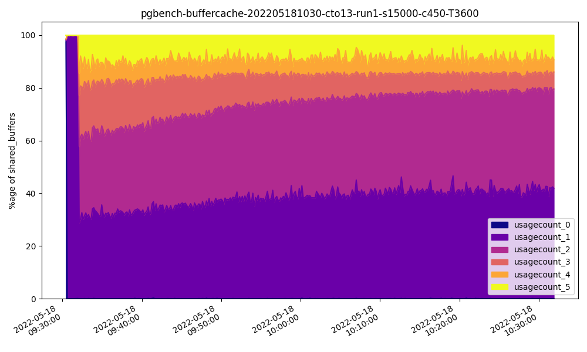

# Ansible Benchmark Framework

This directory contains Ansible playbooks used to aid with testing and benchmarking various R&D projects in the EDB
CTO Team.

The framework is designed to run from a controller machine, which executes everything using Ansible over an SSH 
connection. Tests can be run on any number of machines in parallel, from the *benchmark* group in the Ansible 
inventory. Add the hostnames/IPs of the machines to run the benchmarks to this group.

Optionally, the benchmark software can run on a driver machine rather than the benchmark machine. Add driver machines
to the *driver* group in the Ansible inventory, and then add a property called *driver* to each benchmark machine entry
in the inventory, setting the value to the hostname of the driver machine to use. A separate driver must be used for 
each benchmark machine.

## Quickstart

* Install a minimal installation of Rocky.
* Ensure the login user account can run sudo without a password.
* Accept SSH fingerprints for each server on the machine running Ansible.
* Install the appropriate SSH key to each server from the Ansible host, e.g. by using *ssh-copy-id*.
* Update *inventory.yml* with the hostnames
* Run ```ansible-playbook -i inventory.yml -l benchmark playbooks/config-system.yml``` to install/configure the machines 
in the benchmark group.
* Edit config.yml as required.
* Run the *run-benchmark.sh* script to execute a benchmark test.

## Configuration files

The bulk of the framework is controlled by two configuration files:

### config.yml

*config.yml* is used to define the test parameters. By default, it includes the concept of a "run number"; each test
(pgbench, TPROC-C, TPROC-H) can be executed with a different configuration based on the run number, set in the 
configuration using Jijna2 templating. Options may be configured similar to the following examples:

#### Runs with different values for shared_buffers and the vm.nr_hugepages sysctl

```yaml
# Sysctls to set on the benchmark machines. Always "reset" these to
# default values if you don't need to adjust them, as there's no
# simple way to reset them short of manually clearing /etc/sysctl.conf
# followed by a system reboot.
SYSCTLS:
  - name: vm.nr_hugepages
    value: "{{ 17000 if RUN_NUM|int > 6 else 13000 if RUN_NUM|int > 5 else 8600 if RUN_NUM|int > 4 else 4400 if RUN_NUM|int > 3 else 2300 if RUN_NUM|int > 2 else 720 if RUN_NUM|int > 1 else 260 }}"

# Additional GUCs to set when tuning.
# These will override anything already set.
OVERRIDE_GUCS:
  - name: huge_pages
    value: on
  - name: shared_buffers
    value: "{{ '32GB' if RUN_NUM|int > 6 else '24GB' if RUN_NUM|int > 5 else '16GB' if RUN_NUM|int > 4 else '8GB' if RUN_NUM|int > 3 else '4GB' if RUN_NUM|int > 2 else '1GB' if RUN_NUM|int > 1 else '128MB' }}"
```

#### Runs cumulatively enabling features of an extension

Note that hooks must be added to control what these configuration parameters actually do to enable the features.

```yaml
# my_extension parameters
# Note that run 1 will execute with no features enabled
MY_EXTENSION_FEATURE_ONE: "{{ true if RUN_NUM|int > 1 else false }}"
MY_EXTENSION_FEATURE_TWO: "{{ true if RUN_NUM|int > 2 else false }}"
MY_EXTENSION_FEATURE_THREE: "{{ true if RUN_NUM|int > 3 else false }}"
MY_EXTENSION_FEATURE_FOUR: "{{ true if RUN_NUM|int > 4 else false }}"
MY_EXTENSION_FEATURE_FIVE: "{{ true if RUN_NUM|int > 5 else false }}"
```

Note that additional configuration variables can be set using the *config* hook if preferred (this can be useful if you
have other hooks in a different source tree for testing that code for example). See below for more information.

### inventory.yml

*inventory.yml* is used to define the machines that will be used for the test. A template (*inventory.yml.in*) is 
provided which can be copied and modified to suit your environment. An example inventory file is shown below. Note that
driver machines are optional; if they are not specified, everything will run on the benchmark machines.

```yaml
# Copy this file to inventory.yml, and edit to suit

# The benchmark group is for servers that will run benchmarks
# The controller group is for servers that will manage the benchmark servers

# If separate driver machines are to be used, add them to the "driver" group
# and then add a var to the benchmark host called "driver" with a value
# corresponding to the name of the driver host. Don't use the same driver for
# multiple hosts!!
#
# In the example below, server1 will be driven by server6, and server2 by
# server7. server3 and server4 will run HammerDB locally.

all:
  vars:
    ansible_timeout: 180
  children:
    benchmark:
      hosts:
        server1.example.com:
          driver: server6.example.com
        server2.example.com:
          driver: server7.example.com
        server3.example.com:
        server4.example.com:
    driver:
      hosts:
        server6.example.com:
        server7.example.com:
    controller:
      hosts:
        server5.example.com:
```

## Hooks

It's useful to be able to add additional functionality to the framework in order to perform tasks such as enabling an
extension you want to test. There are a number of hook points defined that can be used for this purpose, each of which 
is a simple YAML file of Ansible tasks that will be included at the hook point.

Hooks are created in the *ansible-local/hooks* directory, where *ansible-local* shares the same parent directory as the 
framework code. For example, if the framework code is checked out into a directory called *ansible*, the structure will
look as follows:

- ansible/
  - images/
  - playbooks/
  - ...
  - README.md (this file)
  - ...
- ansible-local/
  - hooks/
    - clean.yml
    - config.yml
    - config-system.yml
    - ...

The hooks currently defined are as follows:

### clean
__Filename:__ clean.yml

__Applies to host group:__ benchmark

__Description:__ Called at the end of the *clean.yml* playbook to remove any additional artifacts that may need to be
cleaned up.

__Example:__

```yaml
---
- name: Remove my_extension source tree
  file:
    path: ~/my_extension
    state: absent
```

### config
__Filename:__ config.yml

__Applies to host group:__ all

__Description:__ Contains any local variables that need to be configured to control hook behaviour.

__Example:__

```yaml
# my_extension private deploy key path
MY_EXTENSION_DEPLOY_KEY: /Users/dpage/.ssh/id_ed25519.my_extension

# Enable/disable our test extensions
ENABLE_MY_EXTENSION: true
```

### config-system
__Filename:__ config-system.yml

__Applies to host group:__ benchmark

__Description:__ Called at the end of the *config-system.yml* playbook to apply any additional configuration that is 
required on the benchmark machines.

__Example:__

```yaml
---
- name: Upload the private key used for Github cloning
  copy:
    src: "{{ MY_EXTENSION_DEPLOY_KEY }}"
    dest: ~/.ssh/id_my_extension_deploy_key
    mode: u=rw,g=,o=
```

### create-extensions
__Filename:__ create-extensions.yml

__Applies to host group:__ Undefined (typically benchmark)

__Description:__ Called by the *create-extensions* role which is in turn called from various playbooks in order to 
create any extensions that are required on the Postgres servers. This always includes pg_prewarm, but may also be
extended with this hook to install other extensions you may wish to test.

__Example:__

```yaml
---
- name: Create my_extension extension
  shell: |
    {{ postgres_bin }}/psql -h /tmp -c "CREATE EXTENSION IF NOT EXISTS my_extension;" {{ database }}
  when: ENABLE_MY_EXTENSION == true
```

### init-postgres
__Filename:__ init-postgres.yml

__Applies to host group:__ benchmark

__Description:__ Called towards the end of the *init-postgres* playbook, __prior__ to the database password being set
and the server being restarted. Typically used to set any additional GUCs that may be required to enable extension, for
example, in *shared_preload_libraries*.

__Example:__

```yaml
---
- name: Enable/disable my_extension as required
  shell: |
  echo "shared_preload_libraries = '{{ 'my_extension' if ENABLE_MY_EXTENSION else '' }}'" >> ~/pgsql/data/postgresql.conf
  touch ~/pgsql/data/.shared_preload_libraries
  args:
  creates: ~/pgsql/data/.shared_preload_libraries
```

### log-stats
__Filename:__ log-stats.yml

__Applies to host group:__ driver/benchmark

__Description:__ Called at the end of the main *log-stats* role, this hook is used to log additional data from 
the database servers pre and post run. Note that care must be taken to run tasks on the driver machines if present.

__Example:__

```yaml
---
- name: Record the my_extension stats
  shell: |
    echo "" >> {{ log_file }}
    echo "my_extension_stats" >> {{ log_file }}
    echo "================================================================================" >> {{ log_file }}
    echo "" >> {{ log_file }}
    
    {{ postgres_bin }}/psql -h {{ host }} -c "SELECT * FROM my_extension_stats();" {{ database }} >> {{ log_file }}

  when: ENABLE_MY_EXTENSION
  delegate_to: "{{ hostvars[inventory_hostname].driver if hostvars[inventory_hostname].driver is defined else omit }}"
  environment:
    PGPASSWORD: "{{ lookup('password', '{{ playbook_dir }}/../credentials/{{ ansible_user_id }}.txt') }}"
```

### tune-postgres
__Filename:__ tune-postgres.yml

__Applies to host group:__ benchmark

__Description:__ Called at the end of the *tune-postgres* playbook which is in turn called from various playbooks in 
order to perform any additional tasks required to tune Postgres prior to a test run. This may be used (for example) to
enable functionality provided by previously loaded extensions, or to run a script that will determine and set a value 
for a GUC.

__Example:__

```yaml
---
- name: Configure my_extension
  shell: |
    {{ postgres_bin }}/psql -h /tmp -c "SELECT * FROM my_extension_config();" postgres
  when: ENABLE_MY_EXTENSION
```

## Scripts

A number of scripts are provided to make it easy to execute multiple runs of a benchmark and to extract the results
from the log files generated.

### run-benchmark.sh

The ```run-benchmark.sh``` script can be used to execute a benchmark run. It takes three command line parameters:

```bash
$ ./run-benchmark.sh
Usage: ./run-benchmark.sh pgbench|tprocc|tproch [<number of runs (default: 6)>] [<first run number (default 1)>]

Run a benchmark of the specified type, optionally specifying the number of runs and the first run number.
```

#### Examples

Execute a standard 6 run pgbench test:

```bash
$ ./run-benchmark.sh pgbench
```

Execute run 5 of a TPROC-C test:
```bash
$ ./run-benchmark.sh tprocc 1 5
```

Execute runs 3 - 6 of a TPROC-H test:

```bash
$ ./run-benchmark.sh tproch 3 3
```

### copy-results.sh

The ```copy-results.sh``` script can be used to copy a directory containing result log files in to another directory
in which they will be organised into the structure typically used to store them on Google Drive.

```bash
$ ./copy-results.sh ~/tmp ~/my_test_results
/Users/dpage/tmp/tprocc-202205121310-cto13-run1-w1250-u250.log
/Users/dpage/tmp/tprocc-202205121310-cto14-run1-w1250-u250.log
/Users/dpage/tmp/tprocc-202205121310-cto15-run1-w1250-u250.log
/Users/dpage/tmp/tprocc-202205121310-cto16-run1-w1250-u250.log
/Users/dpage/tmp/tprocc-202205121426-cto13-run2-w1250-u250.log
/Users/dpage/tmp/tprocc-202205121426-cto14-run2-w1250-u250.log
/Users/dpage/tmp/tprocc-202205121426-cto15-run2-w1250-u250.log
/Users/dpage/tmp/tprocc-202205121426-cto16-run2-w1250-u250.log
/Users/dpage/tmp/tprocc-202205121543-cto13-run3-w1250-u250.log
/Users/dpage/tmp/tprocc-202205121543-cto14-run3-w1250-u250.log
...

$ ls -alR ~/my_test_results
total 0
drwxr-xr-x  13 dpage  staff   416 May 13 10:53 .
drwxr-xr-x+ 81 dpage  staff  2592 May 13 10:53 ..
drwxr-xr-x   6 dpage  staff   192 May 13 10:53 tprocc Run 1
drwxr-xr-x   6 dpage  staff   192 May 13 10:53 tprocc Run 2
drwxr-xr-x   6 dpage  staff   192 May 13 10:53 tprocc Run 3
drwxr-xr-x   6 dpage  staff   192 May 13 10:53 tprocc Run 4
drwxr-xr-x   6 dpage  staff   192 May 13 10:53 tprocc Run 5
drwxr-xr-x   6 dpage  staff   192 May 13 10:53 tprocc Run 6
drwxr-xr-x   6 dpage  staff   192 May 13 10:53 tproch Run 1
drwxr-xr-x   6 dpage  staff   192 May 13 10:53 tproch Run 2
drwxr-xr-x   6 dpage  staff   192 May 13 10:53 tproch Run 3
drwxr-xr-x   6 dpage  staff   192 May 13 10:53 tproch Run 4
drwxr-xr-x   6 dpage  staff   192 May 13 10:53 tproch Run 5

/Users/dpage/my_test_results/tprocc Run 1:
total 1344
drwxr-xr-x   6 dpage  staff     192 May 13 10:53 .
drwxr-xr-x  13 dpage  staff     416 May 13 10:53 ..
-rw-r--r--   1 dpage  staff  168812 May 13 10:53 tprocc-202205121310-cto13-run1-w1250-u250.log
-rw-r--r--   1 dpage  staff  168811 May 13 10:53 tprocc-202205121310-cto14-run1-w1250-u250.log
-rw-r--r--   1 dpage  staff  168812 May 13 10:53 tprocc-202205121310-cto15-run1-w1250-u250.log
-rw-r--r--   1 dpage  staff  168811 May 13 10:53 tprocc-202205121310-cto16-run1-w1250-u250.log

/Users/dpage/my_test_results/tprocc Run 2:
total 1344
drwxr-xr-x   6 dpage  staff     192 May 13 10:53 .
drwxr-xr-x  13 dpage  staff     416 May 13 10:53 ..
-rw-r--r--   1 dpage  staff  168811 May 13 10:53 tprocc-202205121426-cto13-run2-w1250-u250.log
-rw-r--r--   1 dpage  staff  168811 May 13 10:53 tprocc-202205121426-cto14-run2-w1250-u250.log
-rw-r--r--   1 dpage  staff  168811 May 13 10:53 tprocc-202205121426-cto15-run2-w1250-u250.log
-rw-r--r--   1 dpage  staff  168811 May 13 10:53 tprocc-202205121426-cto16-run2-w1250-u250.log

/Users/dpage/my_test_results/tprocc Run 3:
total 1344
drwxr-xr-x   6 dpage  staff     192 May 13 10:53 .
drwxr-xr-x  13 dpage  staff     416 May 13 10:53 ..
-rw-r--r--   1 dpage  staff  168810 May 13 10:53 tprocc-202205121543-cto13-run3-w1250-u250.log
-rw-r--r--   1 dpage  staff  168790 May 13 10:53 tprocc-202205121543-cto14-run3-w1250-u250.log
...
```

### get-results.sh

The ```get-results.sh``` script will extract benchmark results from a directory containing log files, in either text or
table format. The table format will output the results in a comma delimited format for easy copy/pasting into Google 
Sheets or similar; paste the entire block of results into a cell, and use the *Split text to columns* option on the 
popup menu.

```bash
$ ./get-results.sh
Usage: ./get-results.sh pgbench|tprocc|tproch [text|table (default: text)] [<path to logs (default: .)>]

Extract benchmark results for the specified test type, and output them in the specified format.
```

#### Examples

Get TPROC-C results in text format from the current directory:

```bash
$ ../get-results.sh tprocc
./tprocc-202205121310-cto13-run1-w1250-u250.log : 225325 NOPM, 518147 TPM
./tprocc-202205121310-cto14-run1-w1250-u250.log : 218610 NOPM, 502950 TPM
./tprocc-202205121310-cto15-run1-w1250-u250.log : 208903 NOPM, 480381 TPM
./tprocc-202205121310-cto16-run1-w1250-u250.log : 225456 NOPM, 518782 TPM
./tprocc-202205121426-cto13-run2-w1250-u250.log : 304562 NOPM, 700915 TPM
./tprocc-202205121426-cto14-run2-w1250-u250.log : 297428 NOPM, 684625 TPM
...
```

Get TPROC-H results in table format from a different directory:

```bash
$ ./get-results.sh tproch table ~/tmp

109.736,104.696,96.3778,104.238
101.064,99.7464,102.222,106.278
106.196,105.438,102.386,104.676
108.334,110.552,103.788,97.4538
113.41,108.528,124.07,116.551
```
### plot-csv.py

The benchmark framework has the ability to perform additional monitoring whilst tests are running. One option
included will monitor the page usage counts in shared buffers, using the pg_buffercache extension. A CSV file is 
generated with each run, which is downloaded to the controller node alongside the log file for the run. For example:

```bash
$ head pgbench-buffercache-202205181030-cto13-run1-s15000-c450-T3600.csv
timestamp,usagecount_0,usagecount_1,usagecount_2,usagecount_3,usagecount_4,usagecount_5
2022-05-18 10:30:26.827807+01,15968,85,58,10,19,244
2022-05-18 10:30:36.840748+01,1,10438,12,3,2,7
2022-05-18 10:30:46.852814+01,1,4492,12,3,2,7
2022-05-18 10:30:56.864921+01,1,13270,12,3,2,7
2022-05-18 10:31:06.878146+01,1,9678,12,3,2,7
2022-05-18 10:31:16.891612+01,0,5552,12,3,2,7
2022-05-18 10:31:26.903931+01,1,9462,12,3,2,7
2022-05-18 10:31:36.917041+01,1,11517,12,3,2,7
2022-05-18 10:31:46.929552+01,1,13962,12,3,2,7
```

The *plot-csv.py* script can be used to create a nice graph from this data. Note that it's not overly clever; it 
expects the first column to be an ISO8601 formatted timestamp, and subsequent columns to be graphable.

```bash
$ python3 ./plot-csv.py -h
usage: plot-csv.py [-h] [--style {line,area}] [--width WIDTH] [--height HEIGHT] [--title TITLE] [--percent] [--colormap COLORMAP] [--xlabel XLABEL] [--ylabel YLABEL] input

Plot a graph from a CSV file.

positional arguments:
  input                 the CSV file to plot

optional arguments:
  -h, --help            show this help message and exit
  --style {line,area}, -s {line,area}
                        type of chart to create
  --width WIDTH         plot width in inches (default: 10)
  --height HEIGHT       plot height in inches (default: 6)
  --title TITLE, -t TITLE
                        plot title (defaults to the input filename without extension)
  --percent, -p         scale to 100%, rather than printing absolute values
  --colormap COLORMAP, -c COLORMAP
                        matplotlib colormap to use when rendering (default: plasma)
  --xlabel XLABEL       label to display on the X axis
  --ylabel YLABEL       label to display on the Y axis
```

> **NOTE**: This script requires the _pandas_ and _matplotlib_ Python modules. Install these into a suitable virtualenv!

Here's an example:

```bash
$ python3 plot-csv.py results/pgbench-buffercache-202205181030-cto13-run1-s15000-c450-T3600.csv -s area -p --ylabel '%age of shared_buffers'                                                                                                             1 ✘ ╱ ml  
Wrote results/pgbench-buffercache-202205181030-cto13-run1-s15000-c450-T3600.png
```



Here is how we might post-process an entire set of results:

```bash
for f in *buffercache*.csv; do
  python3 ~/git/autotuning/ansible/plot-csv.py $f -s area -p --ylabel '%age of shared_buffers'
done  
for f in *pgstatdb*.csv; do
  python3 ~/git/autotuning/ansible/plot-csv.py $f -s area -p --ylabel '%age of Blocks'
done  
```